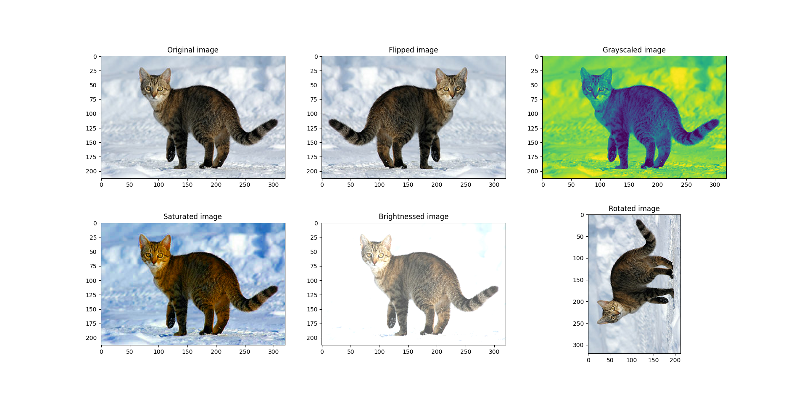

# Make a data augmentation with tensorflow and python

Write your own data augmentation with tensorflow2 and python 3

# Librairies used:
 - [x] Python 3.6
 - [x] Tensorflow 2.1.0
 - [x] Matplotlib 3
 - [x] Tensorflow_docs
 - [x] PIL
 - [x] Brain :)


### How to have it
make sure that you have tensorflow installed on your machine(Laptop). For my case, I have it on ubuntu 18.04.
The best way for you to install dependencies, it is virtualenvwrapper. How to install it in 1 minute -> [VIDEO](https://youtu.be/Tl3q8Wm0jvI)
```
#for dependencies:
pip install -r requirements.txt

#clone it by typing:
git clone https://github.com/bm777/Data_augmentation.git
cd Data_augmentation

#run it by typing:
python3 Data_augment.py
```

### Result of augmentation



### View of original image


### Credict
[TF: tensorflow](https://www.tensorflow.org/tutorials/images/data_augmentation)